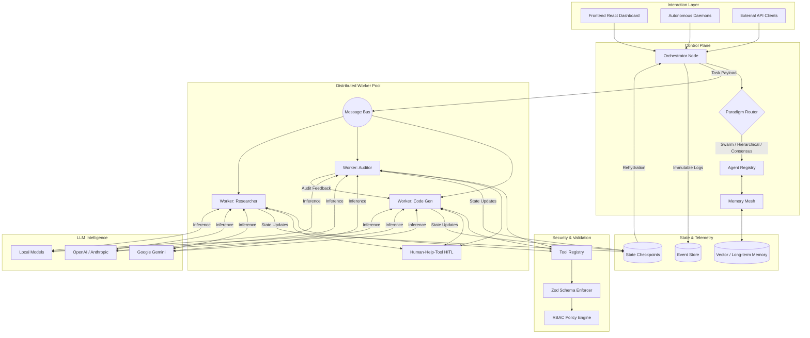

<div align="center">
  

<br />

# 🎻 Orchestra: Enterprise AI Agent Framework

[](https://opensource.org/licenses/MIT)
[](#)
[](#)
[](#)
[](http://makeapullrequest.com)

_An advanced TypeScript framework for building, managing, and scaling autonomous AI agent swarms and agentic workflows._

> **Note:** Orchestra is currently in an early development stage. We are still perfecting the underlying architecture. A working prototype is available to run and test, but it is not perfect.

</div>

Welcome to **Orchestra**, the definitive enterprise-grade **Multi-Agent AI Framework**.

Orchestra goes beyond basic chat-bot wrappers by implementing a robust, distributed architecture that features **self-healing worker pools**, **autonomous background daemons**, **state checkpointing**, and **enterprise-grade security governance**. It is engineered from the ground up to orchestrate dozens of intelligent micro-agents to cooperatively execute complex, multi-layered tasks across autonomous swarm environments.

If you are looking to build responsive, robust, and infinitely scalable **Agentic AI systems**, you're in the right place.

---

## 📖 Origin Story: Why We Built Orchestra

We love the current open-source agent ecosystems, but we found ourselves constantly hitting a wall when moving prototypes to production. We got tired of agents getting stuck in infinite reflection loops, silently failing during temporary API rate limits, and racking up massive $500 LLM bills over the weekend because a recursive worker forgot to terminate. Existing monolithic chat wrappers are incredible for local tinkering, but they lack the rigid governance, asynchronous state recovery, and distributed worker resiliency required by complex enterprise architectures.

Orchestra was explicitly born out of this frustration. We didn't want another chatbot framework; we wanted a robust, cloud-native orchestration layer. We engineered Orchestra around core principles of modern infrastructure—distributed message buses, background daemons, strict schema validations, and idempotent state checkpointing. Our goal is to ensure your AI swarms operate with the exact same reliability as a traditional microservice, turning unpredictable LLM workflows into deterministic, auditable software.

---

## 🌟 Why Orchestra? (Key Capabilities)

We designed Orchestra to solve the most prevalent challenges in current open-source multi-agent systems, specifically scaling complexity, error recovery, LLM token explosion, and non-deterministic outcomes.

- **🧠 Advanced Orchestration Trajectories**: Out-of-the-box support for SWARM, HIERARCHICAL, and CONSENSUS-driven agent workflows.
- **🛡️ Enterprise Governance & Sandboxing**: Strict access controls. Agents are governed by tool schemas, specific API execution rate limits, and isolated file-system sandboxes.
- **💾 State Checkpointing & Resume**: Multi-agent workflows can be fragile. Orchestra autosaves state to persistent storage. Pause, debug, and resume workflows seamlessly upon network failures or API rate limits.
- **⚡ Background Autonomous Daemons**: Agents shouldn't block user interfaces. Orchestra dispatches background workers that poll task queues and autonomously execute work asynchronously.
- **📉 LLM Token Optimization**: Through advanced sliding windows and Semantic Caching, Orchestra reduces repetitive token waste across deep multi-agent conversation threads.
- **🔍 Full Observability & Telemetry**: Native OpenTelemetry bridging via an immutable robust EventStore. Monitor agent thought processes, tool calls, and API failures dynamically in real-time via the built-in **Telemetry Studio**.

### 🛠️ Core Technology Stack

- **Backend**: Node.js (TypeScript), OpenTelemetry (Tracing)
- **Frontend Framework**: React 18, Vite
- **Styling**: Tailwind CSS
- **Data Validation**: Zod schemas for robust tool execution

---

## 🧠 How It Works (Architecture Overview)

<div align="center">
  
</div>

<details>
<summary><strong>View System Diagram Source (Mermaid)</strong></summary>



</details>

### 🏗️ The Five Pillars of Orchestra Architecture

To achieve enterprise-grade reliability, Orchestra is built upon five fundamental architectural pillars:

1.  **Distributed Control Plane**: The `Orchestrator` acts as a stateless brain, delegating high-level reasoning to the `Paradigm Router`. It doesn't execute code itself; instead, it coordinates the lifecycle of complex tasks across Swarm, Hierarchical, and Consensus-driven workflows.
2.  **Autonomous Worker Pools**: Execution is entirely decoupled from the UI. `WorkerNodes` and `AutonomousDaemons` pull specialized tasks from the `Message Bus` (Pub/Sub). This allows the system to scale workers horizontally and recover from individual node failures without losing the global task context.
3.  **Strict Governance & Tool Sandboxing**: Every tool an agent consumes is wrapped in a `Zod Schema`. The `Governance Engine` enforces RBAC (Role-Based Access Control) and resource budgets at the tool-call level, preventing unauthorized file system access or uncontrolled API spending.
4.  **Idempotent State Rehydration**: Through `Persistent State Checkpoints`, Orchestra tracks the "thought history" of every agent. If a network error occurs or the process restarts, the Orchestrator can rehydrate the exact state and resume the task precisely where it left off.
5.  **Deterministic Human-in-the-Loop (HITL)**: High-stakes operations (like deploying code or spending tokens over a certain threshold) trigger a `HumanHelpEvent`. This suspends the agent's execution thread in a "Pending Approval" state, allowing humans to audit the proposed action before it is committed.

---

### 💻 Example: Launching an Agent

```typescript
import { Orchestrator, SwarmParadigm } from "orchestra-framework/orchestration";
import { BaseAgent } from "orchestra-framework/agents";

// 1. Initialize our specialized worker agent with explicitly bound tools
const dataAgent = new BaseAgent({
  name: "DataScraper",
  systemInstruction: "You are an analytics agent. Execute queries carefully.",
  tools: ["SQL_Execute", "WebSearch_MCP"],
});

// 2. Setup the Swarm Orchestration Engine
const orchestrator = new Orchestrator({
  telemetry: true,
  stateCheckpointing: true,
});

// 3. Dispatch the task. The Orchestrator handles queueing, retries, and context management.
await orchestrator.routeTask({
  agent: dataAgent,
  task: "Compile an aggregated report of recent Q3 user signups.",
  paradigm: SwarmParadigm,
  budgetTracker: { maxTokens: 150000, maxIterations: 10 },
});
```

### 📂 Explore Concrete Code Examples

Developers love copy-paste. Jump straight into the action with our dedicated [`/examples`](./examples) directory:

- 🐝 **[`/examples/01-basic-swarm.ts`](./examples/01-basic-swarm.ts)**: A simple script spawning multiple agents to execute a complex research pipeline.
- 🛑 **[`/examples/02-human-approval.ts`](./examples/02-human-approval.ts)**: Triggering a secure, deterministic task freeze for deploying code to production (HITL).
- 🔌 **[`/examples/03-mcp-github.ts`](./examples/03-mcp-github.ts)**: Creating a background daemon that reviews PRs using a standard GitHub MCP integration.
- ⚖️ **[`/examples/04-consensus-debate.ts`](./examples/04-consensus-debate.ts)**: Forcing three biased agents into a blind tribunal debate to assess architectural risk.
- 📊 **[`/examples/05-data-pipeline.ts`](./examples/05-data-pipeline.ts)**: Tearing through bulk data using the MapReduce agent cluster pattern.

### 🎯 Example Use Cases

What can you build with Orchestra?

1. **Automated CI/CD Code Reviewers**: Dispatch a swarm of agents when a GitHub PR is opened. A Security Agent checks for vulnerabilities, a Performance Agent profiles the code, and a Manager Agent synthesizes the final PR comment.
2. **Autonomous Data Intelligence Teams**: A background Daemon monitors your sales database. When metrics dip, it spawns an Analyst Agent to execute SQL, graph the output, and email the results to the team.
3. **Continuous UI Quality Assurance**: Ephemeral worker agents spin up to run end-to-end tests against staging branches, simulating distinct user personas dynamically and logging issues independently to your Jira instance.

---

## ⚡ Orchestra vs. The Ecosystem

We love the current open-source agent ecosystems, but Orchestra is specifically built to address the gaps observed when attempting to take agents out of the terminal and into massive enterprise production.

| Feature                | Orchestra 🎻                                        | LangChain / LangGraph                      | AutoGen / CrewAI                             |
| :--------------------- | :-------------------------------------------------- | :----------------------------------------- | :------------------------------------------- |
| **Execution Model**    | **Distributed Asynchronous Worker Pools (Pub/Sub)** | Synchronous Single-Thread Graph Execution  | Mostly Synchronous / Role-Based Sequential   |
| **Error Recovery**     | **Native Checkpoint & Resume (State Rehydration)**  | Developer must build custom persistence    | Basic Retries / No persistent session state  |
| **Agent Coordination** | **Swarm, Consensus, & Hierarchical (Native)**       | Node-to-Node Graph Routing                 | Turn-based chat / Sequential routing         |
| **Autonomy Level**     | **Background Daemons (Cron/Event loop polling)**    | Triggered explicitly via direct invocation | Primarily interactive terminal conversations |
| **Token Tracking**     | **Semantic Sliding Windows & Vector RAG**           | Manual dict/list manipulation              | Manual tracking / Basic system summarization |
| **Tool Validation**    | **Strict Zod Schemas + MCP Remote Protocol**        | Loose typing / Dynamic prompt injection    | Basic Python function parsing                |
| **Governance & Sec**   | **Hard Tool RBAC, Budgets, Sandboxing**             | Custom architecture required               | Open internal execution                      |
| **Observability**      | **Native OpenTelemetry & Event Store**              | Callback handler system                    | Print-statement / Basic debug logs           |

---

## 🌐 Supported LLM Providers

Orchestra abstracts the LLM interface, allowing you to seamlessly swap out intelligence engines based on pricing, speed, and capability.

- **Google Gemini** (`gemini-1.5-pro-002`, `gemini-1.5-flash-002`) - _Default_
- **OpenAI** (`o1`, `o1-mini`, `gpt-4o`, `gpt-4o-mini`)
- **Anthropic** (`claude-3.5-sonnet`, `claude-3.5-haiku`)
- **Meta Llama** (`llama-3.2-90b`, `llama-3.1-405b`) - _via Groq / Together / Bedrock_
- **Mistral** (`mistral-large-2407`, `pixtral-12b`)
- **DeepSeek** (`deepseek-v3`, `deepseek-coder-v2`)

Configure your preferred providers securely via the `.env` file.

---

## 📚 Comprehensive Documentation & API Reference

**[📖 View the Full API Reference](https://your-github-username.github.io/orchestra/api/)** (Autogenerated via TypeDoc)

We have meticulously documented every facet of Orchestra into dedicated architectural blueprints. Dive deeply into how the framework operates by exploring our comprehensive **`/readme`** directory:

### Core Systems

- 🧠 [Core Orchestration Engine](readme/core-orchestration.md) - How SWARM and Hierarchical queues operate.
- 👥 [Agent Personas & Hierarchies](readme/agent-personas.md) - Manager, Worker, and Daemon delegation.
- 🛠️ [Skill Management & Custom Tools](readme/custom-tools-and-skills.md) - Building validated Zod tools for your agents.
- 🧠 [Memory Layer (Mesh)](readme/memory-layer.md) - Contextual short-term and semantic long-term memory routing.
- 📉 [LLM Token Optimization](readme/token-optimization.md) - Strategies we use to minimize token explosion.
- 🐜 [Advanced Swarm Algorithms](readme/advanced-swarms.md) - Deep dive into Consensus, Debate, and SWARM MapReduce paradigms.
- 💡 [Prompt Engineering Best Practices](readme/prompt-engineering-best-practices.md) - Writing safe, strict boundary System Prompts for scalable agent clusters.

### Infrastructure & Operations

- ⚙️ [Worker Nodes & Background Daemons](readme/worker-nodes.md) - Scaling asynchronous agent logic.
- 📡 [Internal Message Bus & Pub/Sub](readme/message-bus.md) - Inside the global distributed event queue.
- 💾 [Resilience & Checkpointing Recovery](readme/resilience-recovery.md) - Defend against LLM flakiness.
- 🛡️ [Security & Governance](readme/security-governance.md) - Implementing role-based access for AI functions.
- 📊 [Enterprise Telemetry & OpenTelemetry](readme/enterprise-telemetry.md) - Keeping an audit log of autonomous actions.
- 🔍 [Event Sourcing & Distributed Tracing](readme/event-sourcing-and-tracing.md) - A native guide to time-travel debugging inside swarms.
- 🔌 [MCP & Remote Integrations](readme/mcp-and-integrations.md) - Native Model Context Protocol server mounting patterns.
- 🛑 [Human-in-the-loop (HITL)](readme/human-in-the-loop.md) - Suspending state deterministically for human deployment approvals.
- 🚀 [Deployment & Scaling Guide](readme/deployment-and-scaling.md) - Taking Orchestra to production.

---

## 🚀 Installation & Quick Start

Test Orchestra in your own local environment instantly.

> **Security Note:** This repository does NOT store or track any private API keys or personal user details. All sensitive configurations are managed exclusively via your own localized `.env` file.

### Prerequisites

- [Node.js](https://nodejs.org/en/) (v20 or higher recommended)
- An API Key for a supported LLM provider:
  - [Google Gemini API Key](https://aistudio.google.com/app/apikey) (Recommended for default setup)
  - [OpenAI API Key](https://platform.openai.com/)
  - [Anthropic API Key](https://console.anthropic.com/)

### 🚀 Step-by-Step Setup

**1. Clone the repository**

```bash
git clone https://github.com/vinoth2vinoth/orchestra-multi-agent-framework.git
cd orchestra-multi-agent-framework
```

**2. Install Dependencies**

```bash
npm install
```

**3. Configure Environment Variables**
Copy the example environment template and add your API keys. Orchestra supports multiple providers simultaneously for hybrid swarms.

```bash
cp .env.example .env
```

**4. Update .env with your credentials**
Open your newly created `.env` file and insert your API keys:

```env
# Primary Intelligence (Default)
GEMINI_API_KEY="your_google_ai_studio_key"

# Optional: Secondary Providers
OPENAI_API_KEY="sk-..."
ANTHROPIC_API_KEY="sk-ant-..."
```

**5. Start the Application**
Launch the production-ready dev server which handles both the React dashboard and the background Orchestrator.

```bash
npm run dev
```

The local web dashboard should now be running on your browser.
You can interact with the collaborative Project Workspace, assign tasks to agents, and watch as the **Autonomous Daemon** dynamically resolves your tasks in the background!

---

## 🏗️ Project Structure

Understanding the repository layout is key to navigating the framework:

- **`src/framework/`**: The core framework implementing the AI orchestration logic.
  - **`agents/`**: Agent classes, distributed personas, and prompt registries.
  - **`core/`**: Message buses and unified Zod-enforced Event Stores.
  - **`orchestration/`**: Worker pools, background daemons, checkpointers, and routing protocols.
  - **`security/`**: Policy enforcers, resource budget tokens, and RBAC sandboxing.
  - **`tools/`**: Tool registries and external API MCP client implementations.
- **`src/components/`**: React UI application to visualize project boards and interactively chat with your live agents.
- **`readme/`**: The detailed, underlying architectural documentation.

---

## 🗺️ Roadmap 2026/2027

We are actively building the future of distributed multi-agent systems. Prioritized roadmap items:

- [ ] **High-Performance Go/Rust Re-Write:** Re-architecting the core `WorkerPool` queue consumer in Rust/Golang to massively increase concurrent job throughput logic.
- [ ] **First-Class MCP (Model Context Protocol) Support:** Natively connect agents to universal external tools via standard MCP servers without writing custom wrappers.
- [ ] **Multi-Agent Reinforcement Learning (MARL):** Implementing algorithmic feedback loops where agents analyze telemetry logs to autonomously self-optimize prompt logic paths.
- [ ] **Production Dashboards (Grafana/Prometheus):** A standalone web dashboard specifically engineered for visualizing internal OpenTelemetry metrics, worker node heartbeat statuses, and active queue counts.
- [ ] **Multi-Language Interoperability:** A Python SDK for `WorkerNodes`, allowing you to write your ML or Data Science agents in Python and seamlessly connect them up to the primary TypeScript Orchestrator via the Message Bus.
- [ ] **Kubernetes Operator Native Release:** A native Helm chart and Operator to seamlessly deploy `WorkerNodes` dynamically matching Message Bus queue depth using KEDA.
- [ ] **Serverless Execution Engines:** Fully isolated AWS Lambda / Cloudflare Worker deployment pipelines for executing untrusted user-generated agent logic.

---

## 🤝 Contributing

We want Orchestra to become the standard for open-source AI orchestration. We welcome your input, whether you are fixing typos, building new SDK tools, or proposing fundamental architecture shifts!

Please see our [Contributing Guide](CONTRIBUTING.md) for details on how to set up your development environment, run tests, and adhere to our coding standards. Also, please review our [Code of Conduct](CODE_OF_CONDUCT.md).

## ⭐ Support the Project

If you find Orchestra valuable or implement it in your architectural workflows, please **Star this repository** and share it with your network! It deeply motivates maintainers and helps the community grow.

---

_Built to bring order to autonomous agent swarms._
