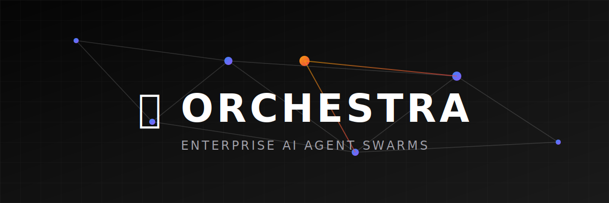
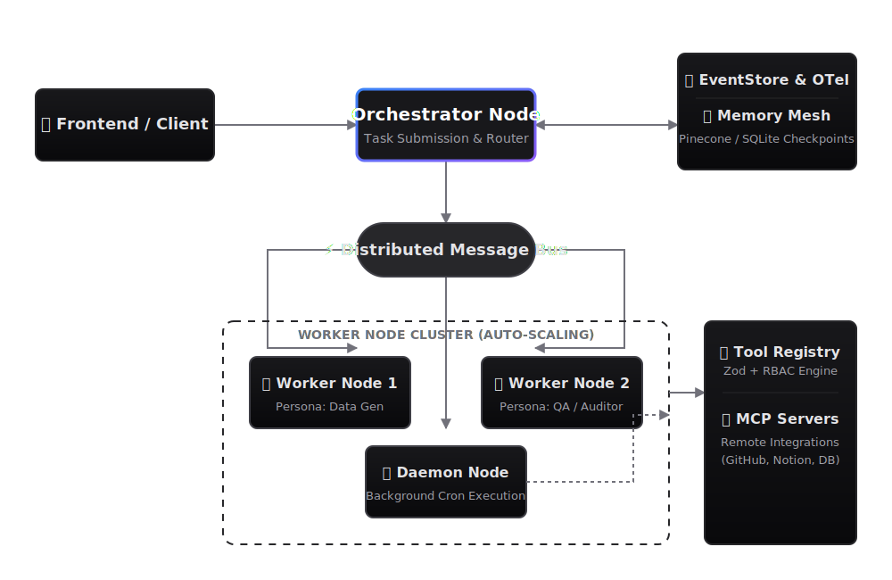
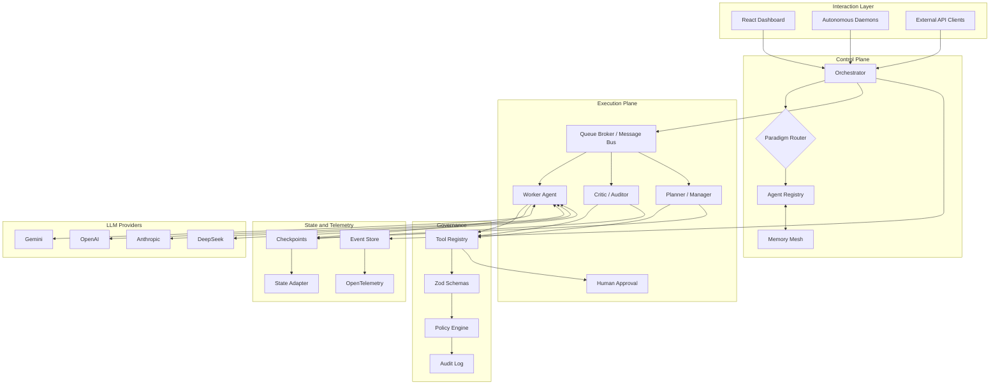

<div align="center">



# Orchestra

### A TypeScript framework for multi-agent AI orchestration, governance, memory, and observable LLM workflows.

[](https://opensource.org/licenses/MIT)
[](https://www.typescriptlang.org/)
[](https://react.dev/)
[](#project-status)
[](CONTRIBUTING.md)

</div>

Orchestra is an early-stage **multi-agent AI framework** for building, testing, and observing agentic workflows in TypeScript. It focuses on the hard parts that appear after a prototype works: orchestration strategy, state recovery, tool safety, human approval, memory, telemetry, and distributed execution patterns.

The project is useful today as a research and development framework for agent orchestration. It is not yet a turnkey production platform. The default setup favors local experimentation; production deployments should enable the security, state, and runtime controls documented below.

## Why Orchestra

Most agent projects start as a chat loop and grow into a fragile web of prompts, tools, retries, and state. Orchestra is built around a more explicit runtime model:

- **Multiple orchestration paradigms**: hierarchical, swarm, decentralized swarm, consensus, debate, graph, event-driven, and map-reduce workflows.
- **Governed tool execution**: Zod schemas, explicit tool modes, path-safe workspace APIs, and policy hooks.
- **Recoverable agent workflows**: checkpointing, approval resume, event sourcing, and shared state adapters.
- **Observable execution**: event logs, OpenTelemetry tracing hooks, telemetry dashboards, and stress/regression tests.
- **Distributed-oriented runtime**: worker pools, queue broker semantics, leases, retries, dead-letter handling, and Redis-ready state.
- **Human-in-the-loop control**: approval gates for high-risk actions and deterministic workflow resume.

Natural use cases include AI code review systems, autonomous research teams, workflow copilots, internal agent platforms, telemetry-heavy LLM experiments, and agent governance prototypes.

## Project Status

Orchestra is in active development. The core TypeScript runtime, dashboard, test harnesses, and several orchestration paradigms are implemented, but some enterprise-facing features are still prototypes or require production infrastructure.

Before production or multi-tenant use:

- Set `ORCHESTRA_API_TOKEN`; do not rely on `ORCHESTRA_DEV_AUTH_BYPASS`.
- Set `ORCHESTRA_ENCRYPTION_KEY`.
- Use `ORCHESTRA_STATE_ADAPTER=redis` with `REDIS_URL` for durable distributed state.
- Keep `ORCHESTRA_ENABLE_CODE_SANDBOX=false` unless code runs in a real container or process sandbox.
- Keep tool execution modes explicit with `ORCHESTRA_TOOL_MODE` or per-tool mode variables.
- Enable `ORCHESTRA_ENABLE_EXPERIMENTAL_PLUGINS=true` only when you accept demo or stochastic plugin behavior.

The `python_orchestra/` directory is a standalone Python prototype for escalation, validation, and routing experiments. It is not connected to the TypeScript orchestrator, queue broker, memory mesh, or HTTP API.

## Architecture

<div align="center">
  
</div>

Orchestra is organized around five runtime concerns:

1. **Control plane**: the `Orchestrator` selects a paradigm and coordinates agents across a workflow.
2. **Execution plane**: worker nodes, queue broker, message bus, and background daemon process work outside the UI loop.
3. **Memory and state**: `MemoryMesh`, checkpointing, event store, and state adapters preserve context and runtime history.
4. **Governance**: tool schemas, policy hooks, audit logs, auth middleware, and human approval protect risky actions.
5. **Observability**: telemetry events, OpenTelemetry spans, diagnostics, stress tests, and dashboard views expose what agents are doing.

<details>
<summary><strong>Mermaid Architecture Diagram</strong></summary>



</details>

## Quick Start

### Prerequisites

- Node.js 20 or later
- npm
- At least one LLM provider key for real model calls

### Install

```bash
git clone https://github.com/vinoth2vinoth/orchestra-multi-agent-ai-framework.git
cd orchestra-multi-agent-ai-framework
npm install
cp .env.example .env
```

Edit `.env` and add at least one provider key:

```env
GEMINI_API_KEY=
OPENAI_API_KEY=
ANTHROPIC_API_KEY=
DEEPSEEK_API_KEY=

ORCHESTRA_API_TOKEN=
ORCHESTRA_DEV_AUTH_BYPASS=true
```

Start the local dashboard and API server:

```bash
npm run dev
```

The app runs on the configured `PORT` or `3000` by default.

## Useful Commands

```bash
npm run lint
npm run build
npx tsx src/framework/testing/run_tests.ts
npx tsx workspace/security_correctness_regression_tests.ts
npx tsx workspace/document_management_regression_tests.ts
```

## Supported Providers

Orchestra includes provider wiring for:

- Google Gemini
- OpenAI
- Anthropic
- DeepSeek

Provider keys should live in `.env` or your deployment secret manager. Do not put provider keys in frontend state or committed config.

## Repository Layout

```text
src/framework/
  agents/          Agent classes and persona abstractions
  consensus/       Weighted Byzantine fault-tolerant consensus helpers
  core/            Event store, message bus, state adapters, runtime context
  governance/      Audit log, policy, genealogy, escalation
  llm/             Provider registry and LLM adapters
  memory/          Semantic memory and summarization
  orchestration/   Orchestrator, workers, queues, checkpointing, paradigms
  plugins/         Lifecycle plugins and enterprise feature experiments
  security/        Sanitization, IAM, secret vault, sandbox boundaries
  storage/         Workspace storage safety and mesh utilities
  testing/         Built-in tests and stress tooling
  tools/           Tool registry, MCP client, external tools, project board

src/components/    React dashboard components
readme/            Deep-dive architecture documentation
workspace/         Local workspace files and regression tests
python_orchestra/  Standalone Python prototype
```

## Documentation

### Core Runtime

- [Core Orchestration](readme/core-orchestration.md)
- [Agent Personas](readme/agent-personas.md)
- [Paradigms](readme/PARADIGMS.md)
- [Memory Layer](readme/memory-layer.md)
- [Message Bus](readme/message-bus.md)
- [Worker Nodes](readme/worker-nodes.md)
- [Resilience and Recovery](readme/resilience-recovery.md)

### Governance, Security, and Operations

- [Security](readme/SECURITY.md)
- [Governance](readme/GOVERNANCE.md)
- [Governance and DLP](readme/GOVERNANCE_AND_DLP.md)
- [IAM and Tenancy](readme/IAM_AND_TENANCY.md)
- [Human in the Loop](readme/human-in-the-loop.md)
- [Enterprise Telemetry](readme/enterprise-telemetry.md)
- [Event Sourcing and Tracing](readme/event-sourcing-and-tracing.md)
- [Testing and Stress](readme/TESTING_AND_STRESS.md)
- [Deployment and Scaling](readme/deployment-and-scaling.md)

### Extensions

- [Custom Tools and Skills](readme/custom-tools-and-skills.md)
- [MCP and Integrations](readme/mcp-and-integrations.md)
- [Plugin Lifecycle Hooks](readme/EXTENDING_WITH_PLUGINS.md)
- [Plugin Map](readme/ORCHESTRA_PLUGINS_MAP.md)
- [Prompt Engineering Best Practices](readme/prompt-engineering-best-practices.md)
- [Token Optimization](readme/token-optimization.md)

## DocArchitect Boundary

[DocArchitect](https://github.com/vinoth2vinoth/DocArchitect) is now a standalone project and is not bundled inside Orchestra. Future integration should happen as a plugin or extension package with explicit version pinning and Orchestra integration tests.

## Examples

The [`examples/`](examples) directory contains small scenario files for swarm orchestration, human approval, MCP integration, consensus debate, and data-pipeline workflows.

These examples are useful for understanding intended patterns, but the framework is still evolving. Prefer the regression tests in `workspace/` and `src/framework/testing/` when validating current behavior.

## Roadmap

- Durable queue backends beyond the local broker
- First-class MCP server mounting
- Stronger multi-tenant isolation
- Production deployment templates
- More deterministic groundedness and evaluation plugins
- Python/TypeScript worker interoperability
- Plugin marketplace and extension packaging
- Hosted observability dashboards

## Contributing

Contributions are welcome, especially around tests, docs, runtime correctness, security hardening, and new orchestration paradigms.

Please read:

- [Contributing Guide](CONTRIBUTING.md)
- [Code of Conduct](CODE_OF_CONDUCT.md)

## License

MIT. See [LICENSE](LICENSE).

## Support

If Orchestra helps your research, prototype, or internal agent platform, consider starring the repository and sharing what you are building. Clear feedback and real-world test cases are especially valuable while the framework matures.

---

Built to bring structure, safety, and observability to multi-agent AI systems.
