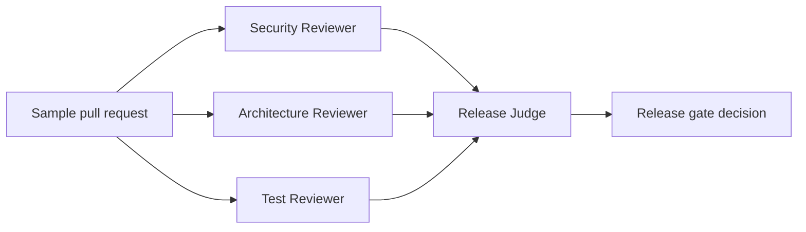

# AI Code Review and Release Governance

This reference app demonstrates Orchestra as a governed multi-agent runtime for release decisions.

It runs fully deterministic local agents by default, so it does not require provider keys or API spend. The goal is to prove orchestration, policy aggregation, auditability, and release gating before adding live provider integrations.

## What It Demonstrates

- A graph workflow with specialist review agents and a release judge.
- Security, architecture, and test-review findings merged into one release decision.
- Human approval escalation when release-blocking or high-risk findings are present.
- Audit/event trail summary for the workflow thread.
- A stable example built on the public `src/framework/index.ts` SDK entrypoint.

## Run

```bash
npm run example:code-review
```

## Validate

```bash
npm run test:reference
```

`npm run test` also includes the reference app regression.

## Workflow



## Expected Demo Outcome

The bundled sample pull request adds a deployment webhook that shells out using request-controlled input and declares no tests. The deterministic reference policy blocks the release and requires human security approval after remediation.

This is intentionally strict. The reference app is meant to show how Orchestra can coordinate high-stakes agent workflows with explicit governance boundaries.
