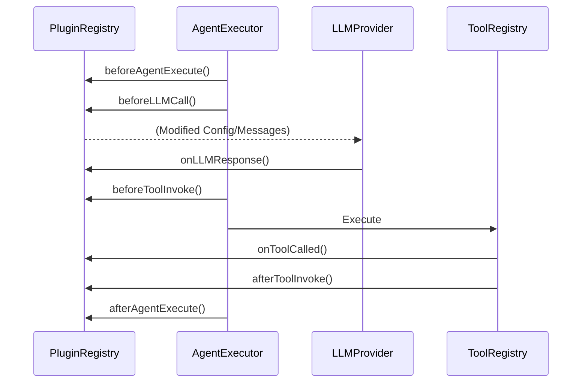

# 🧩 Extending Orchestra with Plugins

Orchestra utilizes a **Recursive Middleware Architecture**. Every stage of an agent's lifecycle—from task reception to tool execution and LLM interaction—is intercepted by the **Plugin System** (defined in `src/framework/core/PluginRegistry.ts`).

## 1. The `AgenticPlugin` Interface

Plugins are typed classes that implement specific lifecycle hooks. Each hook can modify inputs, observe events, or short-circuit execution by returning modified objects, throwing exceptions, or returning structured control objects.

| Hook Category | Hook Name | Description |
| :--- | :--- | :--- |
| **Agent Lifecycle** | `beforeAgentExecute` | Intercept task/input before the agent processes it. |
| | `afterAgentExecute` | Modify or validate the agent's output. |
| | `onAgentFault` | Handle agent-level errors (e.g., for self-healing). |
| **Tool Execution** | `beforeToolInvoke` | Intercept tool arguments (e.g., for HITL or RBAC). |
| | `onToolCalled` | Triggered when a tool begins execution. |
| | `afterToolInvoke` | Post-process tool results or handle errors. |
| | `onToolFault` | Telemetry or recovery for tool-specific failures. |
| **LLM Interaction** | `beforeLLMCall` | Modify prompts, model config, or route to different regions. |
| | `onLLMCall` | Low-level event triggered before the request is sent. |
| | `onLLMResponse` | Track token usage, latency, and raw responses. |

### Execution Flow


## 2. Flow-Control Exceptions

Plugins can alter the system's execution path by throwing specific "Flow-Control Exceptions" found in `src/framework/core/PluginRegistry.ts`:

- **`CacheHitException(data)`**: Immediately returns cached results, bypassing the LLM and Tool layers.
- **`HumanApprovalRequiredException(tool, args, checkpointId)`**: Suspends execution and emits a request for manual intervention.

## 3. Implementation Example: Data Loss Prevention (DLP)

This plugin (found in `plugins/EnterpriseFeatures.ts`) scrubs PII from both incoming tasks and outgoing responses.

```typescript
import { AgenticPlugin } from '../core/PluginRegistry.js';

export class DataLossPreventionPlugin implements AgenticPlugin {
    name = 'DataLossPreventionPlugin';
    version = '1.0.0';

    private regexPatterns = [
        { name: 'EMAIL', pattern: /[a-zA-Z0-9._%+-]+@[a-zA-Z0-9.-]+\.[a-zA-Z]{2,}/g },
        { name: 'CREDIT_CARD', pattern: /\b(?:\d[ -]*?){13,16}\b/g },
        { name: 'SSN', pattern: /\b\d{3}-\d{2}-\d{4}\b/g }
    ];

    private redact(text: string): string {
        if (typeof text !== 'string') return text;
        let redacted = text;
        for (const { name, pattern } of this.regexPatterns) {
            redacted = redacted.replace(pattern, `[REDACTED_${name}]`);
        }
        return redacted;
    }

    async beforeAgentExecute(agentId: string, task: any, threadId: string) {
        if (typeof task === 'string') return this.redact(task);
        return task;
    }

    async afterAgentExecute(agentId: string, task: any, result: any, threadId: string) {
        if (typeof result === 'string') return this.redact(result);
        if (result && typeof result.text === 'string') {
            result.text = this.redact(result.text);
        }
        return result;
    }
}
```

## 4. Built-in Enterprise Plugins

The framework includes a suite of core and experimental plugins in `plugins/EnterpriseFeatures.ts`. Demo or stochastic plugins are disabled by default and require `ORCHESTRA_ENABLE_EXPERIMENTAL_PLUGINS=true`:

### Security & Compliance
- **`DataLossPreventionPlugin`**: Redacts PII (email, credit card, SSN) from agent inputs and outputs using regex patterns.
- **`ZeroTrustRBACPlugin`**: Enforces Role-Based Access Control on specific tool names based on thread context. Throws `Zero-Trust Violation` errors on unauthorized access.
- **`JailbreakDefensePlugin`**: Blocks prompt injection attempts using a blacklist of adversarial phrases (e.g., "ignore previous instructions", "developer mode").
- **`AuditTrailPlugin`**: Generates a SHA-256 hashed immutable log of all tool invocations for regulatory compliance. Maintains a chain of hashes for tamper evidence.
- **`DataSovereigntyRoutingPlugin`**: Dynamically routes LLM calls to specific regions (e.g., `europe-west3` for EU tenants, `us-gov-west-1` for GOV tenants) based on `tenantId` extracted from thread context.

### Performance & Cost
- **`TokenBudgetPlugin`**: Hard-stops execution if a thread exceeds its token quota. Emits `GOVERNANCE` telemetry events when quota is exceeded. Default limit: 250,000 tokens. Uses a 2% buffer before the final call to preemptively halt.
- **`SemanticCachePlugin`**: Uses SHA-256 hashing of tasks to provide O(1) response times for repeated queries. Throws `CacheHitException` on cache hits.
- **`ContextCompressionPlugin`**: Summarizes long conversation histories when they exceed a logical length threshold (default: 10,000 characters). Keeps system prompt + last 5 messages.
- **`TenantComputeRateLimiterPlugin`**: Enforces Requests-Per-Minute (RPM) limits at the tenant level (default: 60 RPM). Throws rate limit errors on exceedance.
- **`ModelRouterPlugin`**: Heuristically routes tasks to different models (e.g., `gemini-2.5-flash` for short tasks, `gemini-1.5-pro` for long tasks) based on input complexity.

### Reliability & Observability
- **`OpenTelemetryTracingPlugin`**: Maps agent, tool, and LLM lifecycles to OTel Spans for distributed tracing. Uses `globalOTelExporter` from `../telemetry/OTelExporter.ts`. Records latency, token usage, and error status codes. Creates spans for `Agent_Execute_<agentId>`, `Tool_Invoke_<toolName>`, and `LLM_Call_<provider>`.
- **`SelfHealingRetryPlugin`**: Automatically catches `onAgentFault`, injects a critique of the error, and retries the execution up to 3 times. Emits `SELF_HEALING_ENGINE` telemetry events. Dynamically imports the agent from `../agents/AgentRegistry.ts` for re-execution.
- **`MetricsExportPlugin`**: Tracks real-time counters for tokens, latency, and success rates for Prometheus/Grafana. Exposes static `metrics` object with `totalLLMCalls`, `totalTokensUsed`, `toolInvocations`, `agentExecutions`, `avgLatencyMs`, `totalLatencyMs`, `lastLatencyMs`.
- **`GroundednessEvaluatorPlugin`**: Experimental stub only. It is not registered by default because it only checks that output is non-empty; enable it explicitly with `ORCHESTRA_ENABLE_STUB_GROUNDEDNESS=true` for local experiments, or replace it with a real groundedness/RAG evaluator before production use.

### Advanced Workflows
- **`HumanInTheLoopApprovalPlugin`**: Intercepts high-risk tools (e.g., `refund_customer`, `execute_trade`, `send_email`) and requires a `_hitl_approved` token. Throws `HumanApprovalRequiredException` with checkpoint IDs for pending approvals. Strips the approval token from args before forwarding.
- **`ShadowModePlugin`**: Forks 10% of traffic to background-test experimental agent versions without impacting users. Emits `SHADOW_TEST_SPAWNED` events.
- **`ContinuousAlignmentPlugin`**: Exports LLM prompt/response pairs in DPO (Direct Preference Optimization) format for model fine-tuning. Emits `DPO_RECORD_EMITTED` events.
- **`EventStreamerPlugin`**: Streams tool executions and LLM responses to external enterprise event buses (e.g., Kafka). Currently uses mock `emitToKafka` method.
- **`AgentTrajectoryDistillationPlugin`**: Captures successful agent trajectories for knowledge distillation into smaller models (SLMs). Only records non-healed, successful executions. Emits `DISTILLATION_RECORD_EMITTED` events.

## 5. Plugin Dependencies and Integration

All plugins in `plugins/EnterpriseFeatures.ts` import from:
- **`../core/PluginRegistry.js`**: Provides `AgenticPlugin` interface, `CacheHitException`, `HumanApprovalRequiredException`, and `globalPluginRegistry`.
- **`../core/EventStore.js`**: Provides `globalEventStore` for emitting structured system events.
- **`../telemetry/TelemetrySystem.js`**: Provides `TelemetrySystem.emit()` for governance and self-healing telemetry.
- **`../telemetry/OTelExporter.ts`**: Provides `globalOTelExporter` for OpenTelemetry span creation (used by `OpenTelemetryTracingPlugin`).
- **`@opentelemetry/api`**: Provides `Span` and `SpanStatusCode` types for OTel tracing.
- **`crypto`**: Node.js built-in for SHA-256 hashing (used by `SemanticCachePlugin`, `AuditTrailPlugin`, `HumanInTheLoopApprovalPlugin`).

## 6. Plugin Registration Pattern

Plugins are registered with the global plugin registry at application startup:

```typescript
import { globalPluginRegistry } from '../core/PluginRegistry.js';
import { DataLossPreventionPlugin, TokenBudgetPlugin } from './EnterpriseFeatures.js';

globalPluginRegistry.register(new DataLossPreventionPlugin());
globalPluginRegistry.register(new TokenBudgetPlugin(500000)); // Custom token limit
```

## 7. Plugin Hook Return Values

Hooks can return the following to control execution flow:

| Return Value | Effect |
| :--- | :--- |
| `undefined` | No modification; continue with original data |
| Modified object | Replace the original data (e.g., `{ llmConfig: newConfig }` for `beforeLLMCall`) |
| `{ args: cleanArgs }` | Replace tool arguments (used by `beforeToolInvoke`) |
| `{ messages: compressedMessages }` | Replace message array (used by `beforeLLMCall`) |
| `{ recovered: true, result }` | Signal recovery from fault (used by `onAgentFault`) |
| `{ recovered: false, result: null }` | Signal recovery failure (used by `onAgentFault`) |
| `throw CacheHitException(data)` | Short-circuit with cached result |
| `throw HumanApprovalRequiredException(...)` | Suspend for manual approval |
| `throw Error(...)` | Abort execution with error |

## 8. Plugin Architecture Diagram

```mermaid
graph TD
    subgraph "Plugin Registry"
        PR[globalPluginRegistry]
    end

    subgraph "Security & Compliance"
        DLP[DataLossPreventionPlugin]
        ZT[ZeroTrustRBACPlugin]
        JD[JailbreakDefensePlugin]
        AT[AuditTrailPlugin]
        DSR[DataSovereigntyRoutingPlugin]
    end

    subgraph "Performance & Cost"
        TB[TokenBudgetPlugin]
        SC[SemanticCachePlugin]
        CC[ContextCompressionPlugin]
        TCR[TenantComputeRateLimiterPlugin]
        MR[ModelRouterPlugin]
    end

    subgraph "Reliability & Observability"
        OT[OpenTelemetryTracingPlugin]
        SH[SelfHealingRetryPlugin]
        ME[MetricsExportPlugin]
        GE[GroundednessEvaluatorPlugin optional stub]
    end

    subgraph "Advanced Workflows"
        HITL[HumanInTheLoopApprovalPlugin]
        SM[ShadowModePlugin]
        CA[ContinuousAlignmentPlugin]
        ES[EventStreamerPlugin]
        ATD[AgentTrajectoryDistillationPlugin]
    end

    PR --> DLP
    PR --> ZT
    PR --> JD
    PR --> AT
    PR --> DSR
    PR --> TB
    PR --> SC
    PR --> CC
    PR --> TCR
    PR --> MR
    PR --> OT
    PR --> SH
    PR --> ME
    PR -. explicit opt-in .-> GE
    PR --> HITL
    PR --> SM
    PR --> CA
    PR --> ES
    PR --> ATD
```



## 9. Plugin Lifecycle Hook Mapping

| Plugin | beforeAgentExecute | afterAgentExecute | onAgentFault | beforeToolInvoke | onToolCalled | afterToolInvoke | onToolFault | beforeLLMCall | onLLMCall | onLLMResponse |
| :--- | :---: | :---: | :---: | :---: | :---: | :---: | :---: | :---: | :---: | :---: |
| DataLossPreventionPlugin | ✓ | ✓ | | | | | | | | |
| TokenBudgetPlugin | | | | | | | | ✓ | | ✓ |
| SemanticCachePlugin | ✓ | ✓ | | | | | | | | |
| AuditTrailPlugin | | | | | ✓ | | | | | |
| MetricsExportPlugin | ✓ | ✓ | | | ✓ | | | | ✓ | ✓ |
| GroundednessEvaluatorPlugin | | ✓ | | | | | | | | |
| ModelRouterPlugin | | | | | | | | ✓ | | |
| OpenTelemetryTracingPlugin | ✓ | ✓ | ✓ | ✓ | ✓ | ✓ | ✓ | ✓ | | ✓ |
| ZeroTrustRBACPlugin | | | | | ✓ | | | | | |
| ContinuousAlignmentPlugin | | | | | | | | | ✓ | ✓ |
| ShadowModePlugin | ✓ | | | | | | | | | |
| ContextCompressionPlugin | | | | | | | | ✓ | | |
| JailbreakDefensePlugin | ✓ | | | | | | | | | |
| SelfHealingRetryPlugin | | | ✓ | | | | | | | |
| TenantComputeRateLimiterPlugin | | | | | | | | ✓ | | |
| EventStreamerPlugin | | | | | ✓ | | | | | ✓ |
| HumanInTheLoopApprovalPlugin | | | | ✓ | | | | | | |
| DataSovereigntyRoutingPlugin | | | | | | | | ✓ | | |
| AgentTrajectoryDistillationPlugin | ✓ | ✓ | | | | | | | | |
