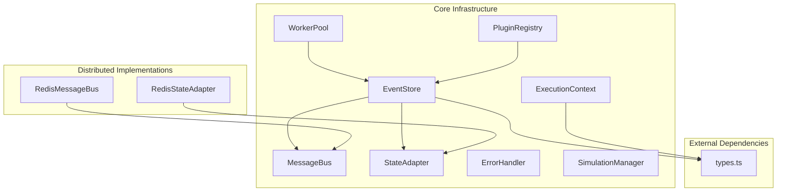
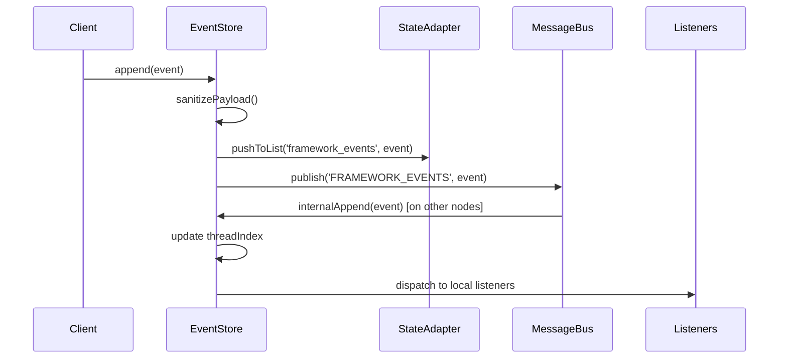
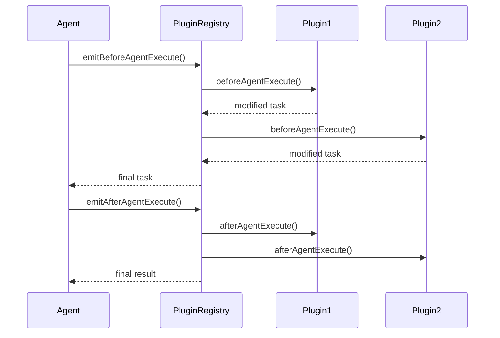
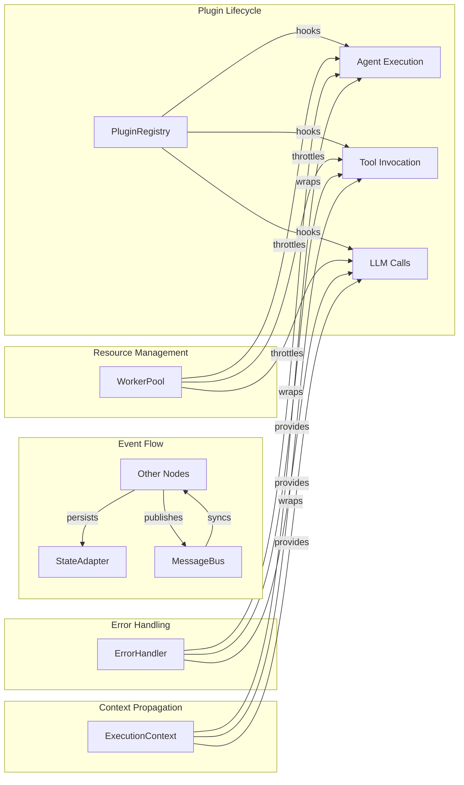
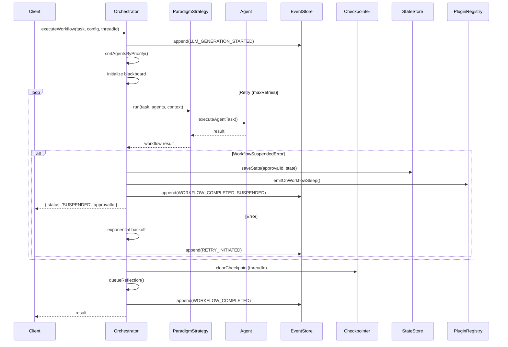
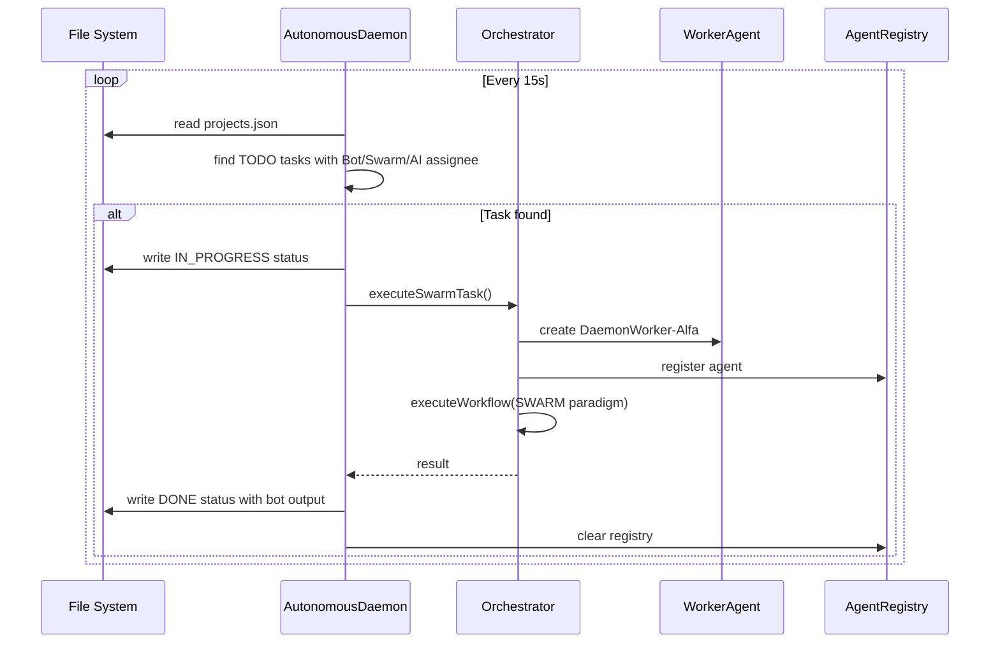
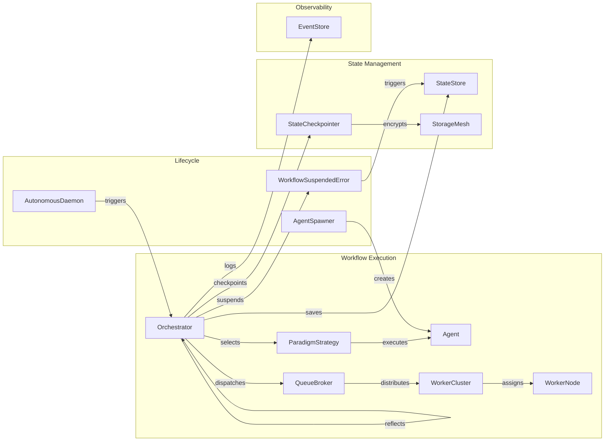

# 🧠 Core Orchestration Engine

The Core layer (found in `src/core/`) provides the foundational execution infrastructure for multi-agent workflows, including event management, state persistence, distributed messaging, plugin lifecycle, error handling, and resource throttling.



## 1. Types (`core/types.ts`)

Central type definitions used across the entire framework.

### EventType Enumeration

```typescript
export type EventType = 
    | 'AGENT_SPAWNED'
    | 'AGENT_TERMINATED'
    | 'TASK_DELEGATED'
    | 'TOOL_CALL_REQUESTED'
    | 'TOOL_CALL_COMPLETED'
    | 'LLM_GENERATION_STARTED'
    | 'LLM_GENERATION_COMPLETED'
    | 'MEMORY_STORED'
    | 'MEMORY_RETRIEVED'
    | 'ERROR_THROWN'
    | 'CONSENSUS_VOTE'
    | 'WORKFLOW_COMPLETED'
    | 'SYSTEM_HOOK'
    | 'TELEMETRY_EMIT'
    | 'HUMAN_INTERVENTION_REQUIRED';
```

### Core Interfaces

```typescript
export interface FrameworkEvent {
    id: string;
    timestamp: number;
    type: EventType;
    sourceAgentId: string;
    targetAgentId?: string;
    threadId: string;
    payload: any;
    tenantId?: string;
}

export interface AgentCard {
    id: string;
    name: string;
    description: string;
    capabilities: string[];
    role: 'MANAGER' | 'WORKER' | 'CRITIC' | 'ORCHESTRATOR' | 'PLANNER' | 'JUDGE';
    priority?: number;
    urgency?: number;
    lineage: {
        parentId?: string;
        spawnedAt: number;
    };
}

export interface MemoryEntry {
    id: string;
    tier: MemoryTier;
    content: any;
    timestamp: number;
    metadata: Record<string, any>;
    tenantId?: string;
}

export type MemoryTier = 'CORE' | 'WORKING' | 'EPISODIC' | 'SEMANTIC' | 'PROCEDURAL';
```

## 2. Event Store (`core/EventStore.ts`)

The `EventStore` manages the append-only event log for the entire system. It supports distributed persistence via `StateAdapter` and cross-node synchronization via `MessageBus`.

### Architecture



### Key Features

- **Distributed Persistence**: Events are persisted to `globalStateAdapter` (configurable backend)
- **Cross-Node Sync**: Publishes events via `globalMessageBus` for multi-instance deployments
- **Security Scrubbing**: All payloads are sanitized via `Sanitizer.scrubSecrets()` before storage (Dimension 10)
- **Memory Management**: Per-thread tail limit of 100 events, global tail limit of 1000 events (Dimension 04)

### Methods

| Method | Description |
|--------|-------------|
| `append(event)` | Creates sanitized event with UUID and timestamp, persists to StateAdapter, publishes to MessageBus |
| `subscribe(listener)` | Registers local listener, returns unsubscribe function |
| `getEventsByThread(threadId)` | Returns frozen copy of thread events |
| `getLogs()` | Returns frozen copy of all events |
| `getSnapshotAtTimestamp(threadId, timestamp)` | Returns events up to a specific timestamp |
| `clear()` | Resets all in-memory state |

### Performance Optimizations

- **Per-Thread Tail Limit**: Keeps only last 100 events per thread in memory
- **Global Tail Limit**: Keeps only latest 1000 events overall, rebuilds indexes when exceeded
- **Deduplication**: Uses `eventIds` Set to prevent duplicate local appending

## 3. Message Bus (`core/MessageBus.ts`)

Provides an abstraction for inter-component communication with circuit breaker protection.

### IMessageBus Interface

```typescript
export interface IMessageBus {
    publish(topic: string, message: any): Promise<void>;
    subscribe(topic: string, handler: (message: any) => void): Promise<() => void>;
}
```

### LocalMessageBus

In-process implementation with built-in rate limiting and circuit breaker:

- **Rate Limit**: 1000 events per second
- **Circuit Breaker**: Trips when rate limit exceeded, auto-resets after 10 seconds
- **Async Dispatch**: Uses `setTimeout` to simulate distributed nature

### RedisMessageBus (`core/RedisMessageBus.ts`)

Distributed implementation using Redis Pub/Sub:

- **Trace Propagation**: Automatically injects `traceId` for distributed debugging
- **JSON Envelope**: Wraps messages in structured envelope with trace metadata
- **Dynamic Subscription**: Auto-subscribes/unsubscribes Redis channels based on handler count

## 4. State Adapter (`core/StateAdapter.ts`)

Provides an interface for distributed state management, enabling horizontal scaling.

### StateAdapter Interface

```typescript
export interface StateAdapter {
    get<T>(key: string): Promise<T | null>;
    set<T>(key: string, value: T, ttlSeconds?: number): Promise<void>;
    delete(key: string): Promise<void>;
    pushToList(key: string, value: any): Promise<number>;
    getRange(key: string, start: number, end: number): Promise<any[]>;
    acquireLock(key: string, ttlMs: number): Promise<boolean>;
    releaseLock(key: string): Promise<void>;
}
```

### Implementations

| Implementation | File | Use Case |
|----------------|------|----------|
| `MemoryStateAdapter` | `core/StateAdapter.ts` | Development, single-instance |
| `RedisStateAdapter` | `core/RedisStateAdapter.ts` | Production, multi-container |

### RedisStateAdapter Details

- **Connection**: Configurable via `REDIS_URL` env var (default: `redis://localhost:6379`)
- **Retry Strategy**: Exponential backoff (50ms initial, 2000ms max)
- **Error Handling**: Logs errors without crashing
- **Lock Mechanism**: Uses Redis `SET NX PX` for distributed locking

## 5. Error Handler (`core/ErrorHandler.ts`)

Standardized error handling with structured context and chain preservation.

### AgentFrameworkError

```typescript
export class AgentFrameworkError extends Error {
    constructor(
        public message: string,
        public code: string,
        public context: ErrorContext,
        public originalError?: any
    )
}
```

### ErrorContext Interface

```typescript
export interface ErrorContext {
    agentId?: string;
    threadId?: string;
    task?: any;
    provider?: string;
    timestamp: string;
}
```

### Features

- **Stack Trace Preservation**: Appends original error's stack trace when available
- **Serialization**: `toJSON()` method for structured logging
- **Contextual Metadata**: Includes agent, thread, task, and provider information

## 6. Plugin Registry (`core/PluginRegistry.ts`)

Lifecycle hook system for extending agent behavior without modifying core code.

### AgenticPlugin Interface

```typescript
export interface AgenticPlugin {
    name: string;
    version: string;
    
    // Lifecycle Hooks
    beforeAgentExecute?: (agentId, task, threadId) => Promise<any | void>;
    afterAgentExecute?: (agentId, task, result, threadId) => Promise<any | void>;
    
    beforeToolInvoke?: (agentId, toolName, args, threadId) => Promise<{toolName?, args?} | void>;
    onToolCalled?: (agentId, toolName, args, threadId) => Promise<void>;
    afterToolInvoke?: (agentId, toolName, args, result, threadId) => Promise<void>;
    onToolFault?: (agentId, toolName, args, error, threadId) => Promise<void>;
    
    onWorkflowSleep?: (threadId, state) => Promise<void>;
    onWorkflowResume?: (threadId, state) => Promise<void>;
    
    onAgentFault?: (agentId, error, task, threadId) => Promise<{recovered, result?} | void>;
    
    beforeLLMCall?: (agentId, llmConfig, messages, threadId) => Promise<{llmConfig?, messages?} | void>;
    onLLMCall?: (agentId, messages, threadId) => Promise<void>;
    onLLMResponse?: (agentId, response, usage, threadId) => Promise<void>;
}
```

### Hook Execution Flow



### Special Exceptions

| Exception | Purpose |
|-----------|---------|
| `CacheHitException` | Short-circuits execution with cached response |
| `HumanApprovalRequiredException` | Triggers human-in-the-loop workflow suspension |

## 7. Execution Context (`core/ExecutionContext.ts`)

Async-local storage for maintaining execution context across async operations.

### ExecutionContext Interface

```typescript
export interface ExecutionContext {
    tenantId: string;
    agentId: string;
    threadId: string;
    capabilities: string[];
}
```

### API

| Function | Description |
|----------|-------------|
| `getExecutionContext()` | Returns current context, throws if outside execution scope |
| `runWithContext(context, fn)` | Executes function within provided context |

### Usage Pattern

```typescript
import { runWithContext, getExecutionContext } from './core/ExecutionContext.ts';

// Set context
runWithContext({ tenantId: 't1', agentId: 'a1', threadId: 'th1', capabilities: [] }, async () => {
    // Retrieve context anywhere in async chain
    const ctx = getExecutionContext();
    console.log(ctx.agentId); // 'a1'
});
```

## 8. Worker Pool (`core/WorkerPool.ts`)

Semaphore-based resource throttling to prevent resource exhaustion (Dimension 04).

### Configuration

- **Default Max Concurrency**: 10
- **Environment Override**: `MAX_CONCURRENCY` env var (default: 8 for global pool)

### Methods

| Method | Description |
|--------|-------------|
| `run(task, agentId, threadId)` | Acquires slot, executes task, releases slot |
| `getStatus()` | Returns `{ active, queued, limit }` |

### Execution Flow

```typescript
const result = await globalWorkerPool.run(
    async () => {
        // Heavy LLM/Tool operation
        return await someExpensiveOperation();
    },
    agentId,
    threadId
);
```

## 9. Simulation Manager (`core/SimulationManager.ts`)

Toggles simulation mode for testing without real LLM calls.

### API

| Method | Description |
|--------|-------------|
| `enable()` | Activates simulation mode |
| `disable()` | Deactivates simulation mode |
| `isActive()` | Returns current simulation state |

## Architecture Interaction Diagram



## Configuration & Environment Variables

| Variable | Default | Used By | Purpose |
|----------|---------|---------|---------|
| `ORCHESTRA_STATE_ADAPTER` | `memory` | `StateAdapter` | Set to `redis` for durable distributed queue/state |
| `REDIS_URL` | `redis://localhost:6379` | `RedisMessageBus`, `RedisStateAdapter` | Distributed messaging and state |
| `MAX_CONCURRENCY` | `8` | `WorkerPool` | Resource throttling limit |

## Error Handling

| Error | Source | Handling |
|-------|--------|---------|
| `AgentFrameworkError` | Any component | Structured error with context and chain preservation |
| `CacheHitException` | Plugin system | Short-circuits execution with cached response |
| `HumanApprovalRequiredException` | Plugin system | Triggers workflow suspension for human approval |
| `Missing execution context` | `ExecutionContext` | Throws when `getExecutionContext()` called outside context |

---

# 🎼 Orchestration Layer

The Orchestration layer (found in `src/orchestration/`) provides the execution engine for multi-agent workflows, including agent spawning, workflow orchestration, state persistence, distributed queuing, and paradigm-based execution strategies.

```mermaid
flowchart TD
    subgraph "Orchestration Core"
        ORC[Orchestrator]
        SPA[AgentSpawner]
        CHK[StateCheckpointer]
        STO[StateStore]
        QBR[QueueBroker]
        WCL[WorkerCluster]
        WNO[WorkerNode]
        AUT[AutonomousDaemon]
        WSE[WorkflowSuspendedError]
    end

    subgraph "Paradigm Strategies"
        PAR[ParadigmStrategy]
        HIE[HierarchicalStrategy]
        CON[ConsensusStrategy]
        SWA[SwarmStrategy]
        MAP[MapReduceStrategy]
        MOA[MOAStrategy]
        GRA[GraphStrategy]
        EVE[EventDrivenStrategy]
        DEC[DecentralizedSwarmStrategy]
        DEB[DebateStrategy]
    end

    subgraph "External Dependencies"
        EVT[globalEventStore]
        PLG[globalPluginRegistry]
        POL[globalPolicyEngine]
        AUD[globalAuditLog]
        CIR[globalCircuitBreaker]
        WKP[globalWorkerPool]
        ESC[globalEscalationManager]
        STG[globalStorageMesh]
    end

    ORC --> PAR
    ORC --> EVT
    ORC --> PLG
    ORC --> POL
    ORC --> AUD
    ORC --> CIR
    ORC --> WKP
    ORC --> ESC
    ORC --> CHK
    ORC --> STO
    ORC --> QBR
    SPA --> EVT
    AUT --> ORC
    AUT --> EVT
    CHK --> STG
    WCL --> WNO
    WCL --> QBR
    PAR --> HIE
    PAR --> CON
    PAR --> SWA
    PAR --> MAP
    PAR --> MOA
    PAR --> GRA
    PAR --> EVE
    PAR --> DEC
    PAR --> DEB
```



## 1. Orchestrator (`orchestration/Orchestrator.ts`)

The `Orchestrator` is the central execution engine that manages multi-paradigm workflow execution. It supports 9 distinct paradigms, retry logic with exponential backoff, workflow suspension for human-in-the-loop approval, autonomous self-reflection, and distributed queue dispatching.

### Paradigm Registry

The orchestrator maintains a registry of all supported paradigms, instantiated in the constructor:

```typescript
private paradigmRegistry: Map<Paradigm, ParadigmStrategy> = new Map();

constructor() {
    this.paradigmRegistry.set('HIERARCHICAL', new HierarchicalStrategy());
    this.paradigmRegistry.set('CONSENSUS', new ConsensusStrategy());
    this.paradigmRegistry.set('SWARM', new SwarmStrategy());
    this.paradigmRegistry.set('MAP_REDUCE', new MapReduceStrategy());
    this.paradigmRegistry.set('MOA', new MOAStrategy());
    this.paradigmRegistry.set('GRAPH', new GraphStrategy());
    this.paradigmRegistry.set('EVENT_DRIVEN', new EventDrivenStrategy());
    this.paradigmRegistry.set('DECENTRALIZED_SWARM', new DecentralizedSwarmStrategy());
    this.paradigmRegistry.set('DEBATE', new DebateStrategy());
}
```

### WorkflowConfig Interface

```typescript
export interface WorkflowConfig {
    paradigm: Paradigm;
    maxIterations?: number;
    maxRetries?: number;
    agents: BaseAgent[];
    edges?: { from: string; to: string }[]; // Used for GRAPH
    events?: { [eventName: string]: string[] }; // Used for EVENT_DRIVEN (event -> agentIds)
    blackboard?: Record<string, any>; // Persistent shared state
    useDistributedQueue?: boolean; // Enable horizontal scalability
}
```

### Execution Flow



### Key Features

- **Agent Prioritization**: Agents are sorted by urgency, priority, and role weight before execution
- **Cycle Detection**: Tracks active dependency chains per thread, throws deadlock error if agent appears >100 times
- **Conversational Depth Limit**: Maximum 10 nested calls per thread branch
- **Distributed Queue Support**: When `useDistributedQueue` is true, tasks are dispatched via `QueueBroker` with 5-minute timeout
- **Autonomous Self-Reflection**: After workflow completion, queues a non-blocking reflection that analyzes execution logs and distills wisdom mutations

### Self-Reflection Engine

The `runSelfReflection` method analyzes completed thread logs to extract meta-level wisdom:

```typescript
private async runSelfReflection(threadId: string, agents: BaseAgent[]) {
    const events = globalEventStore.getEventsByThread(threadId);
    if (events.length < 5) return;
    
    // Uses top-priority agent to analyze logs
    // Outputs SYSTEM_OPTIMIZATION or BEHAVIORAL_MUTATION rules
    // Applies instructional mutations to all agents via agent.mutate(rule)
}
```

### Workflow Resume

The `resumeWorkflow` method handles human-in-the-loop approval:

```typescript
public async resumeWorkflow(approvalId: string, resolution: 'APPROVED' | 'REJECTED' | 'MODIFIED', feedback?: string, agents?: BaseAgent[]): Promise<any>
```

- **REJECTED**: Deletes state, returns `{ status: 'TERMINATED' }`
- **APPROVED/MODIFIED**: Resolves approval via `EscalationManager`, emits `onWorkflowResume` plugin hook, re-executes workflow with optional feedback injection

### Agent Task Execution

The `executeAgentTask` private method handles individual agent execution with:

- **Cycle Detection**: Tracks agent ID frequency in dependency chain
- **Conversational Depth**: Enforces `MAX_CONVERSATIONAL_DEPTH = 10`
- **Distributed Queue**: When enabled, dispatches via `QueueBroker` with 5-minute timeout
- **Silence Timeout**: `MAX_SILENCE_TIMEOUT_MS = 60000` per agent response

## 2. Agent Spawner (`orchestration/AgentSpawner.ts`)

The `AgentSpawner` provides static methods for dynamically creating and terminating worker agents at runtime.

### Methods

| Method | Description |
|--------|-------------|
| `spawnSpecialist(name, expertise, memory, llmConfig, parentId)` | Creates a `WorkerAgent` with description based on expertise, auto-detects capabilities (web_search for search, code_interpreter otherwise) |
| `terminate(agentId)` | Appends `AGENT_TERMINATED` event to EventStore |

### Usage

```typescript
const specialist = AgentSpawner.spawnSpecialist(
    'SearchBot-1',
    'web search and data extraction',
    memoryMesh,
    { modelName: 'gemini-2.5-flash', apiKey: '...' },
    'parent-agent-id'
);
```

## 3. State Checkpointer (`orchestration/Checkpointer.ts`)

The `StateCheckpointer` provides LangGraph/Temporal-style state persistence with AES-256-GCM encryption for data-at-rest protection.

### CheckpointData Interface

```typescript
export interface CheckpointData {
    threadId: string;
    stepId: string;
    state: any;
    timestamp: number;
}
```

### Encryption Details

- **Algorithm**: AES-256-GCM (hardware-accelerated)
- **Key Derivation**: SHA-256 hash of `ORCHESTRA_ENCRYPTION_KEY` env var (fallback: `'default-framework-key-do-not-use-in-prod'`)
- **IV**: 12 bytes random per encryption
- **Auth Tag**: 16 bytes GCM authentication tag
- **Storage Format**: `iv:authTag:encrypted` (hex-encoded)

### Methods

| Method | Description |
|--------|-------------|
| `saveCheckpoint(threadId, stepId, state)` | Serializes state, encrypts, writes to `StorageMesh` at `.orchestra/checkpoints/{threadId}.enc` |
| `getLatestCheckpoint(threadId)` | Reads encrypted file, decrypts, returns `CheckpointData` or null |
| `clearCheckpoint(threadId)` | Overwrites checkpoint file with `'COMPLETED_AND_CLEARED'` |

### Global Instance

```typescript
export const globalCheckpointer = new StateCheckpointer();
```

## 4. State Store (`orchestration/StateStore.ts`)

The `StateStore` manages serialized workflow state for suspended workflows, enabling resume after human approval.

### Methods

| Method | Description |
|--------|-------------|
| `saveState(approvalId, state)` | Stores state keyed by approval ID |
| `getState(approvalId)` | Retrieves state by approval ID |
| `deleteState(approvalId)` | Removes state after workflow resume/termination |

### Global Instance

```typescript
export const globalStateStore = new StateStore();
```

## 5. Queue Broker (`orchestration/QueueBroker.ts`)

The `QueueBroker` provides distributed task queuing for horizontal scalability. When `useDistributedQueue` is enabled in `WorkflowConfig`, tasks are dispatched through the broker instead of executing locally.

### Task Interface

```typescript
export interface QueueTask {
    taskId: string;
    threadId: string;
    agentId: string;
    agentConfig: AgentCard;
    payload: any;
    blackboard?: Record<string, any>;
}
```

### Methods

| Method | Description |
|--------|-------------|
| `publish(task)` | Publishes task to distributed queue |
| `subscribe(handler)` | Registers handler for incoming tasks |
| `acknowledge(taskId)` | Marks task as completed |

### Global Instance

```typescript
export const globalQueueBroker = new QueueBroker();
```

## 6. Worker Cluster (`orchestration/WorkerCluster.ts`)

The `WorkerCluster` manages a pool of `WorkerNode` instances for distributed task execution.

### Methods

| Method | Description |
|--------|-------------|
| `addNode(node)` | Registers a worker node |
| `removeNode(nodeId)` | Deregisters a worker node |
| `getAvailableNodes()` | Returns nodes ready for work |
| `dispatchTask(task)` | Assigns task to an available node |

## 7. Worker Node (`orchestration/WorkerNode.ts`)

The `WorkerNode` represents a single worker in the cluster, capable of executing tasks.

### Properties

| Property | Description |
|----------|-------------|
| `id` | Unique node identifier |
| `status` | `'IDLE'` or `'BUSY'` |
| `capabilities` | List of supported task types |

### Methods

| Method | Description |
|--------|-------------|
| `execute(task)` | Executes a task and returns result |
| `heartbeat()` | Reports node health status |

## 8. Autonomous Daemon (`orchestration/AutonomousDaemon.ts`)

The `AutonomousDaemon` provides background monitoring and autonomous task execution. It polls a `projects.json` file in the workspace directory and automatically picks up tasks assigned to "Bot", "Swarm", or "AI" agents.

### Configuration

```typescript
constructor(pollIntervalMs = 15000) // Default: 15 seconds
```

### Execution Flow



### Key Features

- **Background Polling**: Monitors `workspace/projects.json` at configurable interval
- **Autonomous Task Pickup**: Automatically claims tasks with Bot/Swarm/AI assignees
- **Optimistic Locking**: Sets task to `IN_PROGRESS` before execution
- **Async Execution**: Fires swarm tasks without blocking the daemon loop
- **Error Handling**: On failure, reverts task to `TODO` with error message in description

## 9. Workflow Suspended Error (`orchestration/WorkflowSuspendedError.ts`)

Custom error thrown when a workflow requires human intervention.

```typescript
export class WorkflowSuspendedError extends Error {
    public approvalId: string;
    
    constructor(message: string, approvalId: string) {
        super(message);
        this.name = 'WorkflowSuspendedError';
        this.approvalId = approvalId;
    }
}
```

## 10. Paradigm Strategies (`orchestration/paradigms/`)

All paradigm strategies implement the `ParadigmStrategy` interface:

```typescript
export interface ParadigmStrategy {
    run(
        task: any,
        agents: BaseAgent[],
        context: {
            threadId: string;
            blackboard?: Record<string, any>;
            executeAgentTask: (agent: BaseAgent, task: any, threadId: string, paradigm: string, blackboard?: Record<string, any>, parentSpan?: any) => Promise<any>;
            parentSpan?: any;
        },
        config?: WorkflowConfig
    ): Promise<any>;
}
```

### Strategy Overview

| Strategy | File | Pattern | Use Case |
|----------|------|---------|----------|
| **Hierarchical** | `HierarchicalStrategy.ts` | Manager delegates to Workers | Top-down task decomposition |
| **Consensus** | `ConsensusStrategy.ts` | Multiple agents vote on outcome | Decision-making, validation |
| **Swarm** | `SwarmStrategy.ts` | All agents work independently, results merged | Parallel exploration |
| **MapReduce** | `MapReduceStrategy.ts` | Map phase distributes work, Reduce phase aggregates | Data processing pipelines |
| **MOA** | `MOAStrategy.ts` | Mixture of Agents with layered refinement | Complex reasoning chains |
| **Graph** | `GraphStrategy.ts` | DAG-based execution with edges | State machine workflows |
| **Event-Driven** | `EventDrivenStrategy.ts` | Agents react to events | Reactive systems |
| **Decentralized Swarm** | `DecentralizedSwarmStrategy.ts` | P2P agent coordination | Distributed decision-making |
| **Debate** | `DebateStrategy.ts` | Agents debate positions, Judge decides | Critical analysis |

## Architecture Interaction Diagram



## Configuration & Environment Variables

| Variable | Default | Used By | Purpose |
|----------|---------|---------|---------|
| `ORCHESTRA_ENCRYPTION_KEY` | `'default-framework-key-do-not-use-in-prod'` | `StateCheckpointer` | AES-256-GCM encryption key for checkpoint data |
| `GEMINI_API_KEY` | `''` | `AutonomousDaemon` | LLM API key for daemon worker agents |

## Error Handling

| Error | Source | Handling |
|-------|--------|---------|
| `WorkflowSuspendedError` | Orchestrator | Saves state, emits plugin hooks, returns `{ status: 'SUSPENDED', approvalId }` |
| `WORKFLOW_RETRY_EXHAUSTED` | Orchestrator | Throws `AgentFrameworkError` with diagnostic alert, triggers self-reflection |
| `Conversational Deadlock` | Orchestrator | Throws when agent appears >100 times in dependency chain |
| `Maximum conversational depth` | Orchestrator | Throws when chain exceeds 10 nested calls |
| `Distributed task timed out` | Orchestrator | Throws when QueueBroker task exceeds 5-minute timeout |
